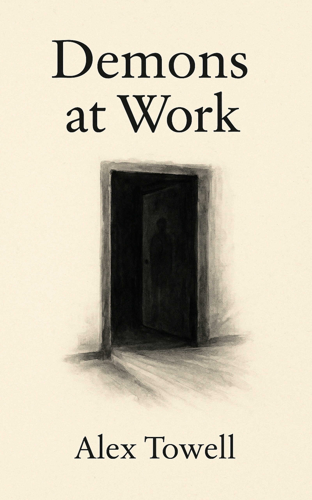

# Demons at Work

[](https://doi.org/10.5281/zenodo.20020300)

A satirical horror novelette narrated by a mid-career demon in hell's Hauntings department.

**Status:** First draft complete (April 2026). 23 chapters, ~13,600 words. KDP-ready pipeline.

## Reading it

- **Amazon:** [Kindle edition](https://www.amazon.com/Demons-at-Work-Alex-Towell-ebook/dp/B0GX2P98MH) ($3.99).
- **From this repository:** the build outputs are tracked, so you can read it directly.
  - [`demons_at_work.pdf`](demons_at_work.pdf), the print reading edition (61 pages).
  - [`demons_at_work.epub`](demons_at_work.epub), the reflowable Kindle edition (chapter vignettes inline).

## The Premise

Horror movie tropes are a demon's actual job, and the job makes no sense from the inside.

The demon spends six weeks flickering lights, whispering names from empty rooms, and crouching motionless in dark corners for hours waiting for someone to glance over. They have the power to drag the target straight to hell. They do this instead. Why?

The book asks. The demon answers. The answers are bureaucratic, professional, and quietly devastating.

## What Lives Underneath

The premise is horror-comedy seen from inside. The book is about something else: what it means to do harmful work well. To be a skilled professional inside a system whose purpose you cannot justify, whose metrics measure nothing real, and whose output causes harm to a person you can see if you look closely enough.

The target is a widower, eight months into grief. The demon's manufactured dread layers onto real sadness, and the target attributes all of it to grief. The demon's best work is invisible, misattributed, folded into a narrative the demon cannot touch.

The arc is craft over outcome. The demon does the work well, knowing it does not work, because the craft is the only thing they have made livable.

## Themes

- The absurdity of evil as a profession
- Sisyphus, but clocking in
- Doing harmful work well: complicity through craft
- Grief as the wrongness the demon competes with and loses to
- The inner life the genre denies

## Repository Structure

```
demons-at-work/
├── chapters/                      # 23 chapter .tex files
├── lore/                          # Worldbuilding and craft documentation
│   ├── themes.md                  # Core joke + canonical decisions
│   ├── world.md                   # Hell as bureaucracy, the house, target's history
│   ├── style.md                   # The dual register (comedy + pathos)
│   └── characters.md              # Tert, Gordon, the office
├── kdp/                           # KDP publishing resources
└── Makefile                       # Build system
```

## Building

```bash
make              # Build PDF + EPUB
make pdf          # PDF only
make epub         # EPUB
```

## Citation

See [`CITATION.cff`](CITATION.cff) and [`.zenodo.json`](.zenodo.json).

## Author

Alex Towell. [lex@metafunctor.com](mailto:lex@metafunctor.com). [metafunctor.com](https://metafunctor.com)

## License

CC-BY-NC-ND-4.0.
